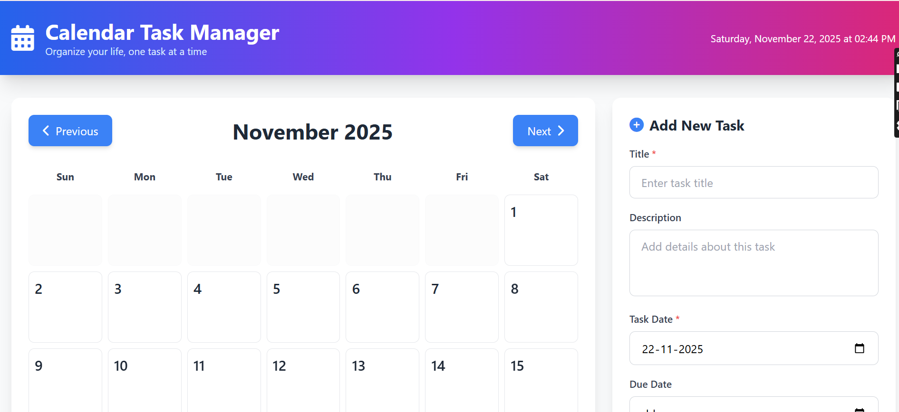
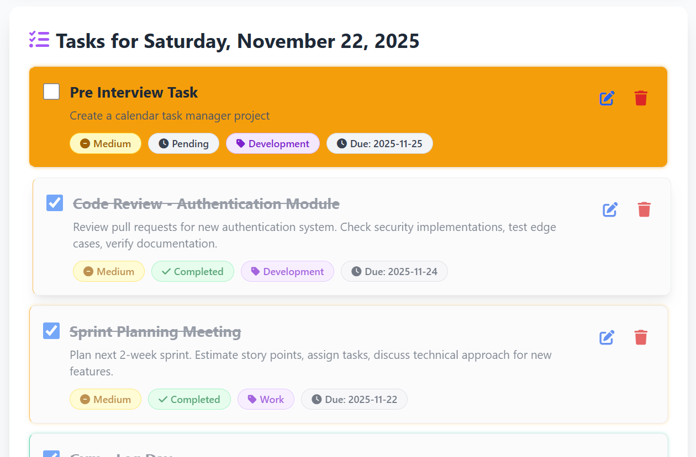

### Calendar Task Management System

A modern and responsive Calendar Task Management System built with PHP, MySQL, HTML, CSS, JavaScript (ES6) and styled using Tailwind CSS.
Features real-time task updates with AJAX and a clean, intuitive UI.

### Core Features

1. Calendar View (Monthly with task indicators)

2. CRUD Operations (Add / Edit / Update / Delete tasks)

3. AJAX-Based Updates (No page reload)

4. Responsive UI (Mobile & Desktop)

5. Filtering System (Priority, Category, Status)

6. CSV Export

7. CSV Import

8. Modern Tailwind CSS Design

9. Advanced Multi-Filter System

### Tech Stack
**Frontend**
HTML
CSS
JavaScript (ES6)
Tailwind CSS 3.x

**Backend**
PHP 

**Database**
MySQL (managed through phpMyAdmin)

**Server**
XAMPP (Apache + MySQL)

### Setup Instructions
**1. Install XAMPP**
Install and run XAMPP
Start Apache + MySQL

**2. Import the Database**
Open:
http://localhost/phpmyadmin/
Create a new DB named: calendar_tasks
Import the SQL file:
**database/schema.sql**

**3. Configure the Backend**
Update your DB credentials in the configuration file:
define('DB_HOST', 'localhost');
define('DB_USER', 'root');
define('DB_PASS', ''); // empty for XAMPP
define('DB_NAME', 'calendar_tasks');
define('DB_CHARSET', 'utf8mb4');

Modify values if your setup is different.

**4. Place the Project in htdocs**
Move your full project folder to:
C:/xampp/htdocs/
Example:

C:/xampp/htdocs/calendar_tasks/

**5. Run the Application**

Open the frontend using:

http://localhost/calendar_tasks/client/
Change folder name if needed.

### Usage Guide
**Add Task**
Use the right sidebar form
Choose task date
Add priority/category
Click Save Task

**View Tasks**
Click a calendar date
Tasks appear below
Priority colors visible on calendar

**Edit Tasks**
Click Edit icon
Form auto-fills
Save changes

**Apply Filters**
Filter by priority/category/status
Click Apply Filters

**CSV Import/Export**
Export: download all tasks
Import: upload CSV file

### Screenshots
### Calendar

### Tasks

### Add Tasks

### Filter Tasks

### Import and Export CSV

   
